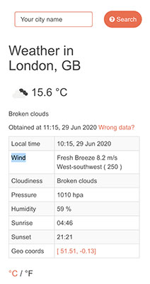
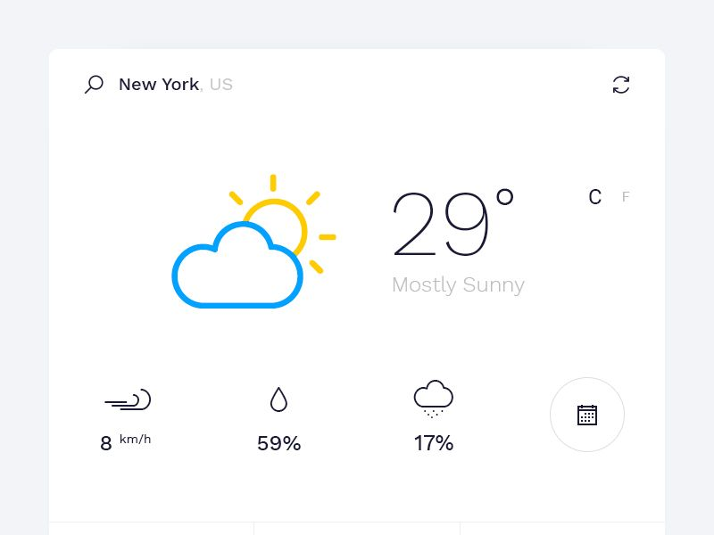
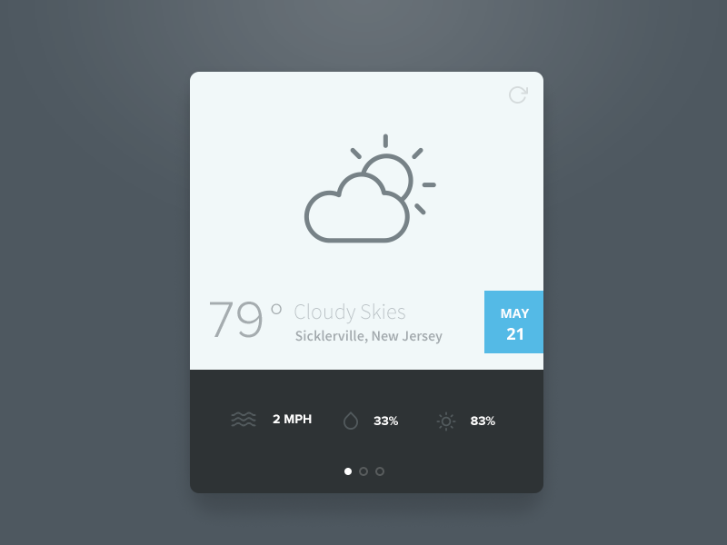
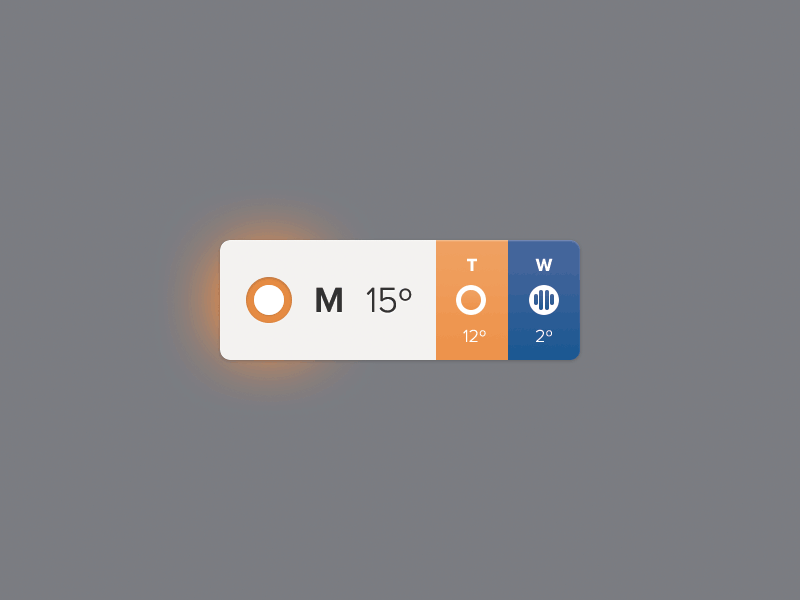
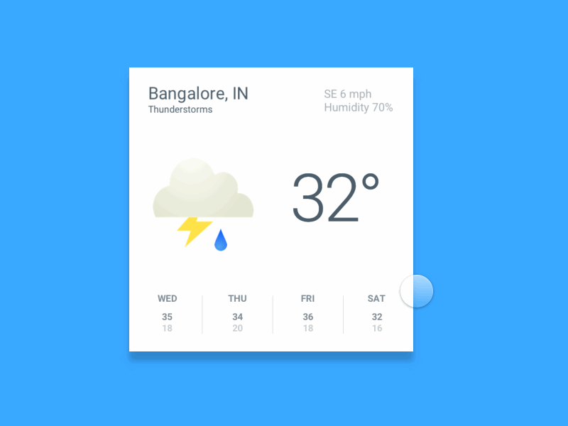

# Approche

## user stories

- En tant qu'utilisateur, je veux pouvoir chercher une ville pour avoir la météo.


## Design

### Vue :

- Moteur de recherche
- Header graphique avec le nom de la ville, description rapide avec picto + température avec swtich de °C à °F en cliquant sur le symbol (info en rollover)
- List des données diverses dans une table



### Style :

Clean, outline, popin-flottant, animations basiques.



## Code

### Datas :

- Les datas sont chargées depuis une api REST qui renvoie une json des données en fonction du nom de ville

ex : [openweathermap.org](https://samples.openweathermap.org/data/2.5/weather?q=London,uk&appid=439d4b804bc8187953eb36d2a8c26a02)

### Composants :

 - Form avec api call
 - Composant header
  - titre(string)
  - Description rapide : Picto(png) {mot clé}(string) : {description}(string)
  - temperature(number) + symbole (°C ou °F)
 - Composant datas
  - Table deux colonnes :
  |intitulé|valeur|
  |-|-|
  |Heure lcoale|10:15, 29 Jun 2020|
  |Pression|1012hp|
  |Humidité|80%|
  |Température minimum|279.15°F|
  |Température maximum|281.15°F|
  |Vent|4.1ms à 80deg|
  |Nuages|90%|


# test

> test

## Build Setup

``` bash
# install dependencies
npm install

# serve with hot reload at localhost:8080
npm run dev

# build for production with minification
npm run build

# build for production and view the bundle analyzer report
npm run build --report

# run unit tests
npm run unit

# run e2e tests
npm run e2e

# run all tests
npm test
```

For a detailed explanation on how things work, check out the [guide](http://vuejs-templates.github.io/webpack/) and [docs for vue-loader](http://vuejs.github.io/vue-loader).
